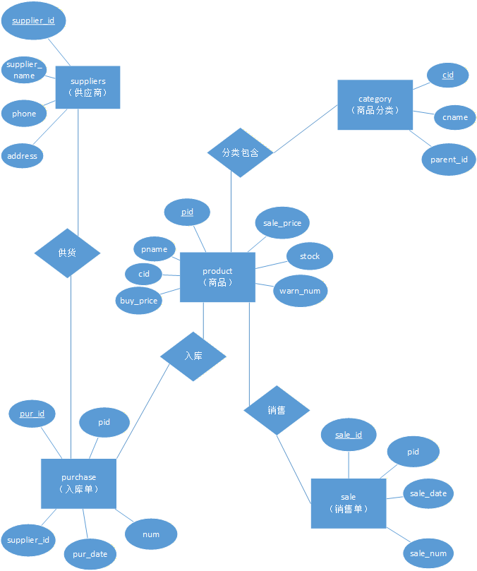

# Inventory_SQL_Project
中小型企业进销存 MySQL 数据库设计
# 进销存数据库设计

## 技术栈
MySQL、DBeaver、Visio

## 项目概述
设计进销存5张关联数据表，绘制ER图，设置主键外键约束；构造测试数据（供应商10条、商品分类10条、商品25条、入库单25条、销售单25条），编写18条统计类业务SQL，实现缺货预警、月度盘点、滞销商品筛选三大实用功能；替代手工Excel盘点，提升库存核算效率。

## 数据库结构

### 核心数据表（5张）

| 表名 | 说明 | 主键 | 外键 |
|------|------|------|------|
| suppliers | 供应商表 | supplier_id | - |
| category | 商品分类表 | cid | - |
| product | 商品表 | pid | cid |
| purchase | 入库单表 | pur_id | pid, supplier_id |
| sale | 销售单表 | sale_id | pid |

### ER关系图


## 文件说明

```
Inventory_SQL_Project/
├── sql/
│   ├── create_table.sql   # 建表+外键语句+测试数据
│   └── business_query.sql # 18条业务统计查询SQL
└── pic/
    └── ER.png             # ER关系图
```

## 业务功能实现

### 1. 缺货预警
- 库存低于预警值的商品查询
- 库存为0的售罄商品查询
- 接近预警线的商品预警

### 2. 月度进销存盘点
- 各类商品月度进销存汇总
- 各商品进销存明细
- 季度进销存统计

### 3. 滞销商品筛选
- 连续30天无销售商品
- 滞销商品库存占比分析
- 长期零销售商品识别

## 使用说明

1. 在DBeaver中新建MySQL数据库连接
2. 创建数据库 `inventory_db`
3. 运行 `sql/create_table.sql` 创建数据表和测试数据
4. 运行 `sql/business_query.sql` 执行业务查询
